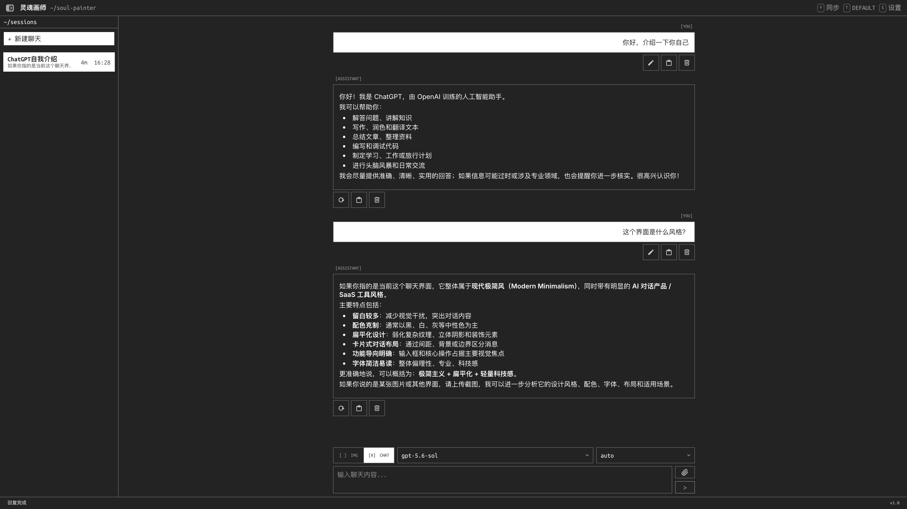
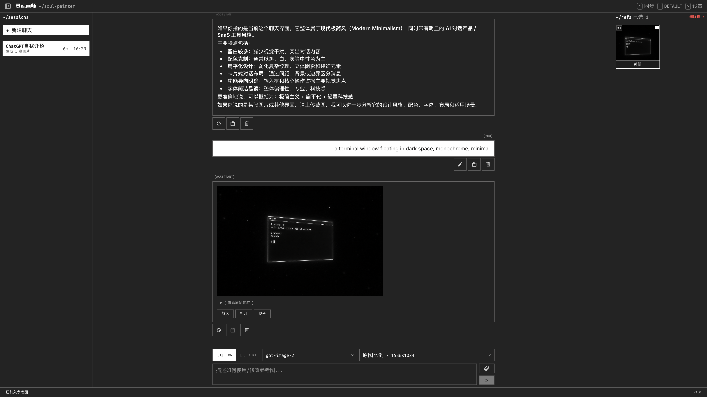
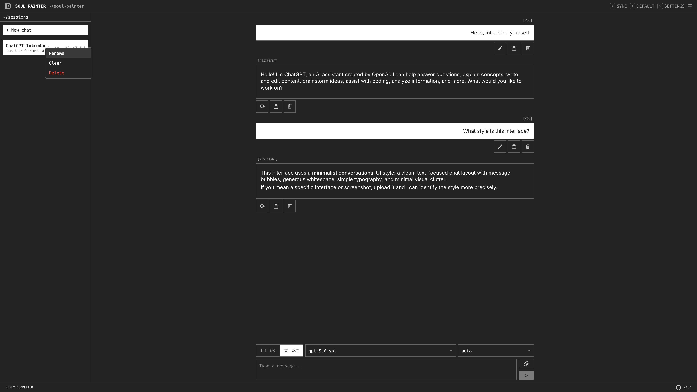
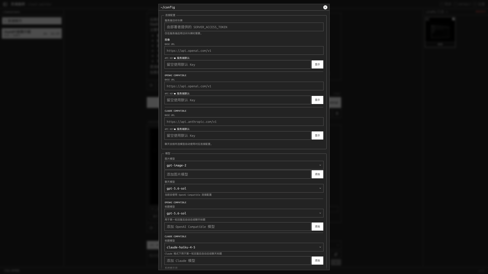
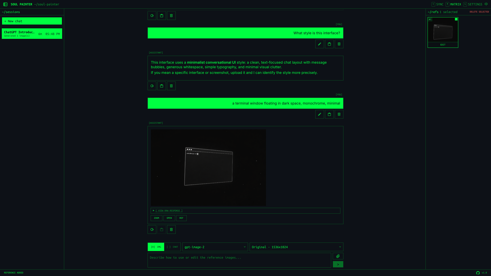
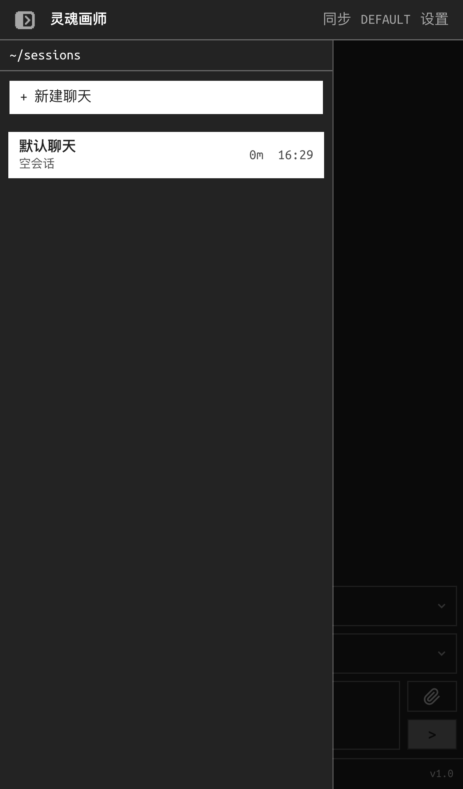
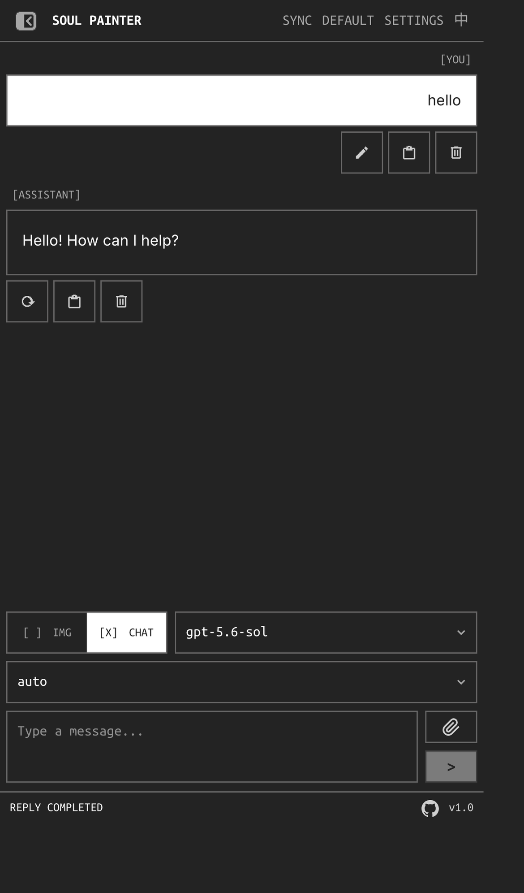

# Soul Painter

A monochrome terminal-desktop AI image generation and chat tool — text-to-image, image-to-image editing, and inpainting with mask painting, styled as a terminal window manager.

## Screenshots

Desktop (4K):

| Chat mode | Generate → 参考 (use as reference) |
|:---:|:---:|
|  |  |

| Session context menu | `~/config` settings window |
|:---:|:---:|
|  |  |

Swappable palettes — `matrix` on desktop:



iOS:

| Session drawer | Chat + composer |
|:---:|:---:|
|  |  |

## Features

- **Terminal Desktop UI** — Full-viewport shell with hairline borders, draggable modal windows, and monospace typography (Inter + Ubuntu Mono)
- **Swappable Themes** — Seven terminal palettes (default, matrix, amber, solarized-dark, monokai, nord, dracula), cycled with `T` or the toolbar button
- **Text-to-Image** — Describe what you want, generate images via API
- **Image-to-Image** — Upload reference images and describe edits
- **Inpainting** — Paint a mask on the reference image to limit edits to specific regions
- **Multi-Reference Edits** — Send any subset of reference images in a single request; all selected images are included
- **Chat Mode** — Streamed conversations against OpenAI or Claude compatible models, with a reasoning-effort selector (OpenAI format) and collapsible thinking blocks
- **Server Runs** — Prompts execute as durable server-side runs that survive reloads and restarts; progress streams over SSE and can be cancelled mid-flight
- **Custom Sizes** — Pick a preset aspect ratio or type a custom `WxH` size
- **Session Sidebar** — Resizable split pane (drag, arrow keys, double-click to reset); right-click or long-press a session for rename/clear/delete; collapses via the header button
- **Message Actions** — Edit-and-resend, regenerate, copy, and delete on any chat message; generated images offer 放大/下载/参考 (lightbox, download, use as reference)
- **Auto Compression** — Oversized images (>1.5MB or any edge >3840px) are automatically downscaled
- **Chat History Sync** — Optional server-side sync across browsers via a username + sync secret; first login creates the account
- **Model Gate** — Optional lock on model selection; triple-tap the footer version stamp to unlock
- **Debug Panel** — Toggle to inspect raw API responses for troubleshooting

## Getting Started

### Prerequisites

- Node.js 20.9+ (required by Next.js 16)
- npm

### Setup

```bash
# Install dependencies
npm install

# Configure environment
cp .env.example .env.local
# Edit .env.local — set your DEFAULT_API_KEY and DEFAULT_BASE_URL

# Start dev server
npm run dev
# → http://localhost:3010
```

### Environment Variables

| Variable | Description |
|---|---|
| `DEFAULT_API_KEY` | API key used when the frontend doesn't provide one |
| `DEFAULT_BASE_URL` | OpenAI-compatible/image base URL; include the provider's version prefix when required, e.g. `https://api.openai.com/v1` |
| `DEFAULT_CHAT_API_KEY` | Optional chat-specific API key; falls back to `DEFAULT_API_KEY` |
| `DEFAULT_CHAT_BASE_URL` | Optional OpenAI-compatible chat base URL; falls back to `DEFAULT_BASE_URL` |
| `OPENAI_CHAT_MODELS` | Comma-separated OpenAI Compatible chat models shown in the selector |
| `DEFAULT_OPENAI_CHAT_MODEL` | Default OpenAI Compatible chat model; defaults to the first configured OpenAI model |
| `DEFAULT_OPENAI_TITLE_MODEL` | OpenAI Compatible model used to generate chat titles; defaults to the last configured OpenAI model |
| `DEFAULT_CLAUDE_API_KEY` | Optional Claude-specific API key; falls back to `DEFAULT_CHAT_API_KEY` |
| `DEFAULT_CLAUDE_BASE_URL` | Optional Claude Compatible base URL; normally `https://api.anthropic.com/v1` |
| `CLAUDE_CHAT_MODELS` | Comma-separated Claude Compatible chat models shown in the selector |
| `DEFAULT_CLAUDE_CHAT_MODEL` | Default Claude Compatible chat model; defaults to the first configured Claude model |
| `DEFAULT_CLAUDE_TITLE_MODEL` | Claude Compatible model used to generate chat titles; defaults to the last configured Claude model |
| `SERVER_ACCESS_TOKEN` | Required in production when a browser uses server-default API keys; enter the same value in Connection Settings |
| `ALLOW_ANONYMOUS_DEFAULT_API_KEY` | Explicitly allows anonymous use of server-default keys; disabled by default |
| `UPSTREAM_HOST_ALLOWLIST` | Comma-separated private hosts allowed as custom upstreams; configured default Base URLs are trusted automatically |
| `ALLOW_PRIVATE_UPSTREAMS` | Disables private-address SSRF blocking globally; use only on a trusted network |
| `ALLOWED_ORIGINS` | Comma-separated origins allowed to read proxy responses cross-origin; same-origin requests need no entry |
| `MODEL_GATE_ENABLED` | Enables the header-tap gate for model access |
| `MODEL_GATE_SECRET` | Secret used to sign the model-gate unlock cookie |
| `CHAT_ASSET_MAX_IMAGE_BYTES` | Maximum size of a single server-stored chat image; defaults to 8 MB |
| `CHAT_ASSET_SESSION_MAX_BYTES` | Maximum chat image storage per browser session; defaults to 256 MB |
| `CHAT_ASSET_SESSION_MAX_FILES` | Maximum saved chat image files per browser session; defaults to 200 |
| `CHAT_ASSET_SESSION_MAX_AGE_DAYS` | Removes inactive chat image sessions after this many days; defaults to 30 |
| `CHAT_ASSET_MAX_BODY_BYTES` | Maximum JSON upload body accepted by the chat asset route |
| `CHAT_ASSETS_MAX_TOTAL_BYTES` | Global disk budget across all chat asset sessions; defaults to 1 GiB |
| `CHAT_ASSET_CACHE_MAX_AGE_SECONDS` | Browser cache lifetime for private chat asset responses; defaults to 3600 |
| `CHAT_ASSET_COOKIE_SECURE` | `auto`, `true`, or `false`; controls whether chat asset cookies require HTTPS |
| `CHAT_ASSET_SESSION_SECRET` | Secret used to sign anonymous chat asset session cookies; falls back to `SERVER_ACCESS_TOKEN`/`DEFAULT_API_KEY`; unsigned when none are set (local dev) |
| `CHAT_ASSET_REMOTE_FETCH_TIMEOUT_MS` | Timeout for server-side remote image mirroring; defaults to 15000 |
| `CHAT_ASSET_REMOTE_FETCH_MAX_REDIRECTS` | Maximum redirects followed while mirroring remote images; defaults to 3 |

### API Key Sources

The app supports four ways to provide API credentials, in priority order:

1. **URL query params** — `?apiKey=sk-xxx&baseurl=https://...`
2. **User input** — Enter in Settings modal (saved to localStorage)
3. **Server default** — Set `DEFAULT_API_KEY` and `SERVER_ACCESS_TOKEN` in `.env.local`, then enter the access token in Connection Settings
4. **None** — Requests return a 401 error until configured

Chat settings can save separate OpenAI Compatible and Claude Compatible credentials at the same time. The selected chat model automatically selects the matching API format. To use Claude directly, select a Claude model, set **Claude Base URL** to `https://api.anthropic.com/v1`, and use an Anthropic API key.

## Usage

### Text-to-Image

1. Type a prompt in the input field
2. Adjust parameters: size, quality, format, N (count), model, background, moderation
3. Press **Enter** or **Ctrl+Enter** to send

### Image-to-Image

1. **Drag & drop**, **paste**, or click the **attachment button** to add reference images
2. Click a thumbnail to toggle selection — all selected images join the request
3. Optionally click **编辑** on a selected thumbnail to open the mask editor — paint red overlay on areas to modify
4. Type instructions describing the desired edits
5. Send

### Keyboard Shortcuts

| Key | Action |
|---|---|
| `Enter` / `Ctrl+Enter` | Send prompt |
| `Shift+Enter` | New line |
| `T` | Cycle theme |
| `Y` | Open sync login |
| `S` / `F1` | Open settings |
| `D` | Toggle debug panel |
| `←` / `→`, `Home` / `End` (sidebar separator focused) | Resize session sidebar |
| `Enter` / `Space` / double-click (separator) | Reset sidebar width |
| `Esc` | Close the topmost overlay (menu, modal, lightbox, drawer) |

## Architecture

- **Framework**: Next.js 16 (App Router) + React 19
- **Styling**: Tailwind CSS v4 with semantic monochrome tokens (`theme-fg`/`theme-bg`/`theme-muted`/`theme-dim`/`error`), hairline `ring-1` borders, and `data-theme` palette overrides
- **State**: React Context (Config, Chat, Image)
- **Workflow orchestration**: `useRunPrompt` submits each prompt as a durable server-side run, then streams updates over SSE with a polling fallback; retries run inside the runner
- **Local persistence**: IndexedDB via `idb-keyval` stores chat sessions, image history, sync tombstones, and stream capability cache; localStorage/sessionStorage are reserved for lightweight settings, prompts, and sync auth metadata
- **Server persistence**: Prisma + SQLite store chat sync metadata in `data/chat-sync.db`; run records live in `data/server-runs.json`; chat image assets are stored on local disk under `data/chat-assets`
- **API Proxy**: `/api/runs` executes requests server-side against an OpenAI Compatible or Claude Compatible upstream, injecting auth from client headers or server env; the lower-level proxy routes remain available for direct use

### API Routes

| Route | Upstream Endpoint | Body Type |
|---|---|---|
| `POST /api/runs` | Runs chat/image requests server-side | JSON |
| `GET`/`DELETE /api/runs/[runId]` | Run status poll / cancel | — |
| `GET /api/runs/[runId]/events` | SSE stream of run updates | — |
| `/api/chat/completions` | OpenAI: `{baseUrl}/chat/completions`; Claude: `{baseUrl}/messages` | JSON |
| `/api/images/generations` | `{baseUrl}/images/generations` | JSON |
| `/api/images/edits` | `{baseUrl}/images/edits` | multipart/form-data |
| `/api/config` | — | Returns server-side key status |
| `/api/chat-assets` | — | Stores or clears local chat image assets |
| `/api/chat-assets/[assetId]` | — | Serves local chat image assets |
| `/api/chat-sync` | — | Syncs chat sessions through Prisma/SQLite |
| `/api/model-gate` | — | Reads or updates model gate state |

### Runtime Notes

The server routes that touch Prisma, SQLite, local chat assets, Node streams, or filesystem APIs run on the Node.js runtime, not the Edge runtime. Deployments need persistent local storage for `data/` or equivalent replacements for SQLite and chat asset files. Serverless platforms without durable local disks require moving sync storage to a managed database and chat assets to object storage.

### Tests

The project uses Vitest for unit coverage of config, storage, sync, asset, and image helpers.

## Scripts

```bash
npm run dev      # Dev server (port 3010)
npm run build    # Production build
npm run start    # Production server (port 3010)
npm run lint     # ESLint
npm run test     # Vitest unit tests
```

## Credits

Inspired by 米醋画图.

## License

MIT
